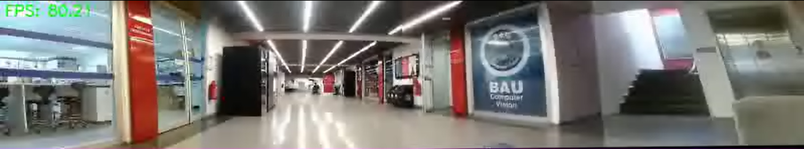

# Panoramic-video-splicing
Combine videos from four fixed positions of the same size into a panoramic video.

将四个相同大小固定位置的视频拼接成全景视频。





## project operation
1. Create a virtual environment (Python=3.6.1)

   创建虚拟环境(python==3.6.1)

2. Download the corresponding version of Python package
   
   下载对应版本的python包

```
pip install -r requirements.txt
```

3. 运行python文件
```
python video_final.py
```

## Project Structure
video_final.py：运行主文件，用于运行video_Horizontal.py和video_stitch.py，拼接res1视频和res2视频，为视频增加FPS指标。

video_Horizontal.py：运行子文件，用于拼接第一个和第二个视频。

video_stitch.py：运行子文件，用于拼接第三个和第四个视频。

src：用于存放四个原始视频。

result：用于存放输出的结果视频。

requirements.txt：重建虚拟环境。